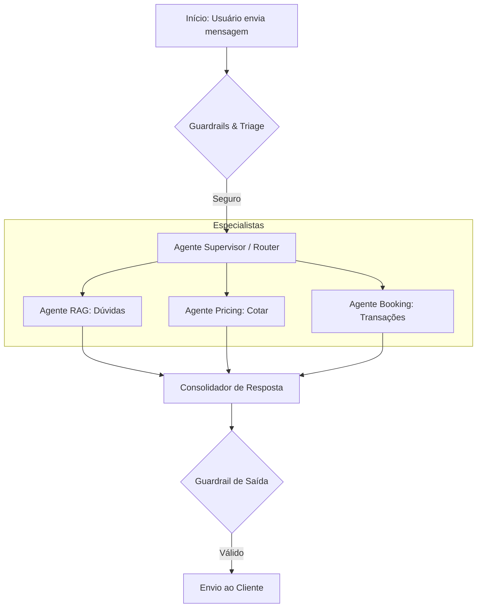

# Fluxo de Atendimento Multi-Agente

O SIA utiliza uma arquitetura de múltiplos agentes (Multi-Agent System - MAS) onde um **Supervisor** coordena especialistas para garantir a melhor resposta.

---

## 🔄 Fluxo de Atendimento Geral

---

## 🤖 Máquina de Estados (LangGraph)

O agente não é apenas um chatbot linear; ele é uma **State Machine** que mantém o contexto da reserva.

| Estado | Descrição | Transição |
| :--- | :--- | :--- |
| **Idle** | Aguardando entrada | Para `Classifying` ao receber msg |
| **Classifying** | Identifica intenção e extrai entidades | Para `Tool_Call` ou `RAG` |
| **Tool_Call** | Executa APIs (Preço, Reserva) | Para `Responding` com dados reais |
| **RAG** | Busca conhecimento na base vetorial | Para `Responding` com contexto |
| **Escalating** | Identifica necessidade de intervenção humana | Hand-off para SQS/Zendesk |
| **Responding** | Gera a resposta final formatada | De volta para `Idle` |

---

## 🛠️ Ferramentas (Tools) disponíveis para a IA

A IA tem acesso a um conjunto de ferramentas "grounded" em APIs determinísticas:

1.  **`buscar_faq`**: Consulta a base de conhecimento (Políticas de cancelamento, documentos).
2.  **`calcular_cotacao`**: Interface real com o motor de preços (Datas, Categoria).
3.  **`criar_reserva`**: Efetivação ACID no banco de dados.
4.  **`consultar_reserva`**: Status em tempo real.
5.  **`escalar_humano`**: Movimentação para atendimento nível 2.

> [!TIP]
> **Grounding:** O LLM nunca "chuta" preços. Ele recebe o JSON da ferramenta e o traduz para linguagem natural amigável.

---

[⬅ Voltar para Início](../README.md) | [Seguir para Soluções Técnicas ⮕](TECHNICAL_SOLUTIONS.md)
