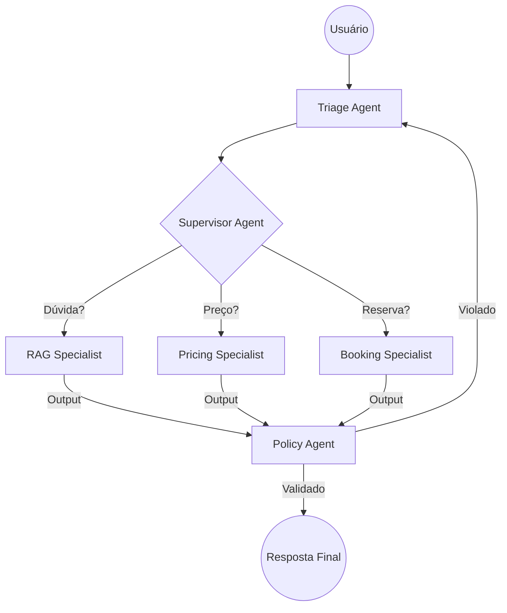

# Orquestração Multi-Agente

Para atingir o nível 10/10, o SIA evolui de um orquestrador único para uma arquitetura de **Múltiplos Agentes Especializados**. Isso permite que cada agente seja otimizado (Fine-tuned ou Prompt-engineered) para uma tarefa específica, aumentando a precisão e reduzindo alucinações.

---

## 🏗️ Padrão: Router-Supervisor

Nesta arquitetura, um **Agente Roteador (Supervisor)** recebe a mensagem do usuário e decide qual especialista é o melhor para resolver o problema.

### Agentes Especialistas:

1.  **🕵️ Agente de Atendimento (RAG Agent):**
    - **Foco:** Dúvidas, Termos e Condições, FAQ.
    - **Ferramenta:** `buscar_faq`.
    - **Meta:** Fornecer respostas "grounded" na documentação oficial.

2.  **💰 Agente de Cotação (Pricing Agent):**
    - **Foco:** Cálculos financeiros, simulações de datas e categorias.
    - **Ferramentas:** `calcular_cotacao`, `listar_adicionais`.
    - **Meta:** Precisão numérica e clareza de valores.

3.  **🎟️ Agente de Reservas (Booking Agent):**
    - **Foco:** Transações, modificações, cancelamentos e CRUD.
    - **Ferramentas:** `criar_reserva`, `consultar_reserva`, `cancelar_reserva`.
    - **Meta:** Integridade transacional e segurança de dados.

4.  **🚨 Agente de Triagem (Triage/Security Agent):**
    - **Foco:** Guardrails, PII masking e escalação humana.
    - **Ferramenta:** `escalar_humano`.

5.  **👮 Agente de Policy (Policy Agent):**
    - **Foco:** Governança, conformidade, segurança e ética.
    - **Ferramenta:** `validar_politica_empresa`, `detectar_pii`.
    - **Meta:** Garantir que nenhuma resposta viole as regras de negócio ou exponha dados sensíveis.

---

## 🔄 Fluxo de Colaboração

---

## ✅ Vantagens do Multi-Agente
- **Manutenibilidade:** Você pode atualizar o prompt do `Booking Agent` sem risco de quebrar o `RAG Agent`.
- **Performance:** Agentes de triagem usam modelos menores/rápidos, enquanto agentes de reserva usam modelos mais robustos (o1/Claude 3.5).
- **Escalabilidade Técnica:** Facilidade para adicionar novos departamentos (ex: Agente de Sinistro, Agente de Fidelidade).

---
[⬅ Voltar para Início](../README.md) | [Ver Blueprint de Código ⮕](../src/BLUEPRINT.md)
